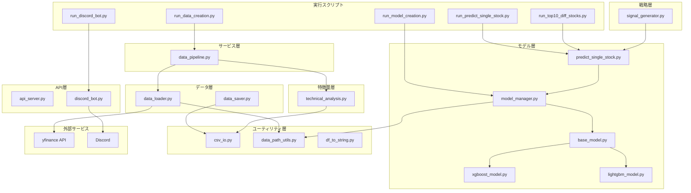

# CuteStock（StockFixer）アーキテクチャナレッジ

本ドキュメントでは、StockFixerプロジェクトのアーキテクチャ、各モジュールの役割、データフローについて詳しく解説します。

---

## 目次
1. [プロジェクト概要](#プロジェクト概要)
2. [ディレクトリ構成](#ディレクトリ構成)
3. [レイヤーアーキテクチャ](#レイヤーアーキテクチャ)
4. [各モジュールの詳細](#各モジュールの詳細)
5. [データフロー](#データフロー)
6. [実行スクリプト一覧](#実行スクリプト一覧)
7. [技術スタック](#技術スタック)
8. [設計思想と原則](#設計思想と原則)

---

## プロジェクト概要

StockFixer（コードネーム: CuteStock）は、**株式自動売買システム**です。

- **Python**: 戦略ロジック、AI価格予測、データ取得・分析、REST API、Discord Bot
- **C#**: 証券会社連携、注文実行、WPF UI（将来実装予定）

主な機能：
- 株価データの自動取得（yfinance経由）
- テクニカル指標の計算（RSI, MACD, EMA, ATR）
- 機械学習モデル（XGBoost, LightGBM）による価格予測
- 売買シグナル生成
- Discord Botによる予測結果の通知

---

## ディレクトリ構成

```
StockFixer/
├── PROJECT_OVERVIEW.md          # システム概要
├── ARCHITECTURE.md              # 本ドキュメント
└── python/
    ├── run_*.py                 # 実行スクリプト（エントリーポイント）
    ├── requirements.txt         # 依存パッケージ
    ├── Dockerfile               # Docker設定
    ├── データ取得対象.csv        # 対象銘柄リスト
    │
    ├── src/                     # ソースコード
    │   ├── api/                 # API・外部インターフェース層
    │   │   ├── api_server.py    # Flask REST APIサーバー
    │   │   └── discord_bot.py   # Discord Bot
    │   │
    │   ├── services/            # オーケストレーション層
    │   │   └── data_pipeline.py # データ取得〜特徴量生成パイプライン
    │   │
    │   ├── models/              # AI予測モデル層
    │   │   ├── base_model.py    # モデル基底クラス（抽象）
    │   │   ├── xgboost_model.py # XGBoost実装
    │   │   ├── lightgbm_model.py# LightGBM実装
    │   │   ├── model_manager.py # モデル管理クラス
    │   │   └── predict_single_stock.py # 単一銘柄予測
    │   │
    │   ├── strategy/            # シグナル生成層
    │   │   └── signal_generator.py # 売買シグナル生成
    │   │
    │   ├── backtest/            # バックテスト層
    │   │   └── backtester.py    # バックテスト実行
    │   │
    │   ├── features/            # 特徴量生成層
    │   │   └── technical_analysis.py # テクニカル指標・ラグ特徴量
    │   │
    │   ├── data/                # データ取得・保存層
    │   │   ├── data_loader.py   # 株価データ取得
    │   │   └── data_saver.py    # データ保存
    │   │
    │   ├── sbi/                 # SBI証券連携
    │   │   └── sbi_api.py       # SBI API
    │   │
    │   └── utils/               # ユーティリティ層（最下層）
    │       ├── csv_io.py        # CSV入出力
    │       ├── data_path_utils.py # パス・ティッカー補正
    │       └── df_to_string.py  # DataFrame整形
    │
    ├── data/                    # 株価データ保存先
    │   └── {market}_{symbol}/   # 例: us_AAPL/, jp_7203/
    │
    ├── models/                  # 学習済みモデル保存先
    │   └── {market}_{symbol}/   # 例: us_AAPL/
    │
    ├── results/                 # 予測結果保存先
    │   └── {YYYYMMDD_HHMMSS}/   # 実行日時別
    │
    └── tests/                   # ユニットテスト
```

---

## レイヤーアーキテクチャ

本システムは**クリーンアーキテクチャ**に近い階層構造を採用しています。
**上位層は下位層のみを参照**し、逆方向の依存は禁止されています。

```
┌─────────────────────────────────────────────────┐
│  run_*.py （エントリーポイント）                 │
└─────────────────────────────────────────────────┘
                        ↓
┌─────────────────────────────────────────────────┐
│  api層 (api_server.py, discord_bot.py)          │
│  - 外部との接点、HTTPリクエスト/Discordコマンド │
└─────────────────────────────────────────────────┘
                        ↓
┌─────────────────────────────────────────────────┐
│  services層 (data_pipeline.py)                  │
│  - ビジネスロジックのオーケストレーション       │
│  - 複数モジュールの連携                         │
└─────────────────────────────────────────────────┘
                        ↓
┌─────────────────────────────────────────────────┐
│  models/strategy/backtest層                     │
│  - AI予測、シグナル生成、バックテスト           │
└─────────────────────────────────────────────────┘
                        ↓
┌─────────────────────────────────────────────────┐
│  features層 (technical_analysis.py)             │
│  - テクニカル指標計算、特徴量エンジニアリング   │
└─────────────────────────────────────────────────┘
                        ↓
┌─────────────────────────────────────────────────┐
│  data層 (data_loader.py, data_saver.py)         │
│  - 外部データソースからの取得・永続化           │
└─────────────────────────────────────────────────┘
                        ↓
┌─────────────────────────────────────────────────┐
│  utils層 (csv_io.py, data_path_utils.py等)      │
│  - 汎用ユーティリティ（最下層）                 │
└─────────────────────────────────────────────────┘
```

---

## 各モジュールの詳細

### api層

#### `api_server.py`
- Flask REST APIサーバー
- C#側（注文実行）との通信インターフェース
- シグナル・予測結果をHTTPエンドポイントで提供

#### `discord_bot.py`
- Discord Botの実装
- `/forecast` コマンドで全マーケットのTop10・ワースト10を送信
- 計算処理は事前実行されたCSVを参照

### services層

#### `data_pipeline.py`
- **データ取得 → 特徴量生成 → 保存** の一連の処理を統合
- `save_stock_data_with_features()`: 銘柄データ取得から特徴量付きCSV保存まで

### models層

#### `base_model.py`
- AIモデルの抽象基底クラス
- `train()`, `predict()`, `save_model()`, `load_model()` の共通インターフェースを定義

#### `xgboost_model.py` / `lightgbm_model.py`
- `BaseModel` を継承した具象クラス
- XGBoost / LightGBM の実装

#### `model_manager.py`
- 複数モデルの管理・学習・予測を統括
- モデルの作成、保存、ロードを一元管理
- **主要メソッド**:
  - `create_model()`: モデルインスタンス作成
  - `train_model()`: 学習実行（自動保存付き）
  - `predict_with_model()`: 予測実行
  - `save_model()` / `load_model()`: 永続化

#### `predict_single_stock.py`
- 単一銘柄の予測を実行
- 複数モデルの予測値を平均化してバイアス低減

### strategy層

#### `signal_generator.py`
- テクニカル分析結果とAI予測を組み合わせて売買シグナル生成
- シグナル: `Buy` / `Sell` / `Hold`
- 予測変化率 > 0.5% → Buy、< -0.5% → Sell

### features層

#### `technical_analysis.py`
- **`add_technical_indicators()`**: テクニカル指標を追加
  - MACD（トレンド）
  - EMA（移動平均）
  - ATR（ボラティリティ）
  - RSI（モメンタム）
- **`create_basic_lag_features()`**: ラグ特徴量（過去N日分）を生成

### data層

#### `data_loader.py`
- **`get_stock_data()`**: yfinanceから株価データ取得
- **`get_stock_data_from_file()`**: ローカルCSVから読み込み
- **`get_forex_data()`**: 為替データ取得

#### `data_saver.py`
- 生データのCSV保存

### utils層

#### `data_path_utils.py`
- `get_data_subdir()` / `get_models_subdir()`: market/symbol別サブディレクトリ取得
- `get_ticker()`: 市場別ティッカー補正（日本株は `.T` 付与）

#### `csv_io.py`
- DataFrameのCSV入出力ユーティリティ

#### `df_to_string.py`
- DataFrameの整形出力

---

## データフロー

### 1. データ作成フロー

```
┌──────────────┐    ┌──────────────┐    ┌──────────────┐    ┌──────────────┐
│ run_data_    │ → │ data_pipeline│ → │ data_loader  │ → │ yfinance API │
│ creation.py  │    │ .py          │    │ .py          │    │              │
└──────────────┘    └──────────────┘    └──────────────┘    └──────────────┘
                            ↓
                    ┌──────────────┐    ┌──────────────┐
                    │ technical_   │ → │ CSV保存       │
                    │ analysis.py  │    │ (data/...)   │
                    └──────────────┘    └──────────────┘
```

### 2. モデル学習フロー

```
┌──────────────┐    ┌──────────────┐    ┌──────────────┐
│ run_model_   │ → │ model_       │ → │ xgboost_/    │
│ creation.py  │    │ manager.py   │    │ lightgbm_    │
└──────────────┘    └──────────────┘    │ model.py     │
                            ↓           └──────────────┘
                    ┌──────────────┐
                    │ joblib保存    │
                    │ (models/...) │
                    └──────────────┘
```

### 3. 予測・シグナル生成フロー

```
┌──────────────┐    ┌──────────────┐    ┌──────────────┐
│ run_predict_ │ → │ predict_     │ → │ model_       │
│ single_stock │    │ single_stock │    │ manager.py   │
└──────────────┘    └──────────────┘    └──────────────┘
                            ↓
                    ┌──────────────┐    ┌──────────────┐
                    │ signal_      │ → │ Discord/API  │
                    │ generator.py │    │ 出力         │
                    └──────────────┘    └──────────────┘
```

---

## 実行スクリプト一覧

| スクリプト | 用途 |
|-----------|------|
| `run_data_creation.py` | 単一銘柄のデータ作成 |
| `batch_run_data_creation.py` | 複数銘柄のバッチデータ作成 |
| `run_model_creation.py` | モデルの学習・保存 |
| `run_predict_single_stock.py` | 単一銘柄の価格予測 |
| `run_predict_watchlist.py` | ウォッチリスト銘柄の一括予測 |
| `run_top10_diff_stocks.py` | Top10/ワースト10銘柄の抽出・保存 |
| `run_discord_bot.py` | Discord Botの起動 |
| `get_sp500_nasdaq100_list.py` | S&P500/NASDAQ100銘柄リスト取得 |

---

## 技術スタック

### Python パッケージ

| パッケージ | 用途 |
|-----------|------|
| `yfinance` | 株価・為替データ取得 |
| `pandas` | データ操作・分析 |
| `ta` | テクニカル指標計算 |
| `xgboost` | 勾配ブースティングモデル |
| `lightgbm` | 勾配ブースティングモデル |
| `scikit-learn` | 機械学習ユーティリティ |
| `flask` | REST APIサーバー |
| `discord.py` | Discord Bot |
| `joblib` | モデルの永続化 |

### 将来の連携（C#側）
- 楽天証券/SBI証券API連携
- WPF UI（運用状況の可視化）

---

## 設計思想と原則

### 1. レイヤー分離
- 上位層→下位層への一方向参照のみ許可
- 各層は明確な責務を持つ

### 2. モジュラー設計
- 機能ごとにモジュールを分離
- 再利用性と保守性を重視

### 3. 拡張性
- `BaseModel` を継承して新しいAIモデルを追加可能
- `register_model_type()` で動的にモデル登録

### 4. データ管理
- 生データと特徴量データを分離
- `{market}_{symbol}` 形式でディレクトリを整理
- 既存CSVを削除してから新規保存（一貫性担保）

### 5. セキュリティ
- `.env` で機密情報を管理
- 認証情報のハードコーディング禁止
- ログに認証情報を含めない

---

## Appendix: Mermaid アーキテクチャ図



---

*Last updated: 2026-02-13*
