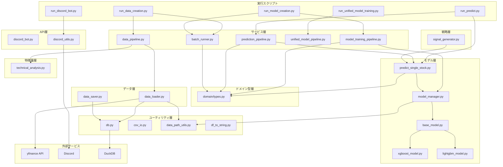

# CuteStock（StockFixer）アーキテクチャナレッジ

本ドキュメントでは、StockFixerプロジェクトのアーキテクチャ、各モジュールの役割、データフローについて詳しく解説します。

---

## 目次
1. [プロジェクト概要](#プロジェクト概要)
2. [ディレクトリ構成](#ディレクトリ構成)
3. [レイヤーアーキテクチャ](#レイヤーアーキテクチャ)
4. [各モジュールの詳細](#各モジュールの詳細)
5. [データフロー](#データフロー)
6. [実行スクリプト一覧](#実行スクリプト一覧)
7. [技術スタック](#技術スタック)
8. [設計思想と原則](#設計思想と原則)

---

## プロジェクト概要

StockFixer（コードネーム: CuteStock）は、**株式自動売買システム**です。

- **Python**: 戦略ロジック、AI価格予測、データ取得・分析、REST API、Discord Bot
- **C#**: 証券会社連携、注文実行、WPF UI（将来実装予定）

主な機能：
- 株価データの自動取得（yfinance経由）
- テクニカル指標の計算（RSI, MACD, EMA, ATR）
- 機械学習モデル（XGBoost, LightGBM）による価格予測
- 売買シグナル生成
- Discord Botによる予測結果の通知

### 時刻処理ポリシー

- 内部処理の日時は UTC を基準とし、timezone-aware な値で扱う。
- 永続化するタイムスタンプ（ジョブ実行時刻、監視更新時刻、生成時刻など）は UTC の ISO 8601 形式を優先する。
- ユーザー向け表示は API 層で日本時間へ変換し、`src/utils/japan_time.py` を経由して整形する。
- Asia/Tokyo が必要なのは「営業日判定」「スケジュール時刻判定」などの業務ロジックであり、保存形式とは分離して扱う。

---

## ディレクトリ構成

```
StockFixer/
├── PROJECT_OVERVIEW.md          # システム概要
├── ARCHITECTURE.md              # 本ドキュメント
└── python/
    ├── run_*.py                 # 実行スクリプト（エントリーポイント）
    ├── requirements.txt         # 依存パッケージ
    ├── Dockerfile               # Docker設定
    ├── データ取得対象.csv        # 対象銘柄リスト
    │
    ├── src/                     # ソースコード
    │   ├── api/                 # API・外部インターフェース層
    │   │   ├── discord_bot.py           # Discord Bot
    │   │   ├── discord_formatters.py    # Discord 表示フォーマッター
    │   │   ├── discord_notification_specs.py # 通知仕様定義
    │   │   ├── discord_text.py          # Discord テキスト定数
    │   │   └── discord_utils.py         # Discord通知ユーティリティ
    │   │
    │   ├── domain/              # ドメイン型定義層（全層共通）
    │   │   └── types.py         # 共有データクラス（SymbolTask / FeatureLoadResult / TrainingMetrics / PredictionResult）
    │   │
    │   ├── services/            # オーケストレーション層（ドメイン別サブパッケージ構成）
    │   │   ├── backtest/        # バックテスト関連パイプライン
    │   │   │   ├── backtest_optimize_pipeline.py # パラメータ最適化
    │   │   │   ├── backtest_pipeline.py          # 単一バックテスト
    │   │   │   ├── portfolio_backtest.py          # ポートフォリオBT
    │   │   │   ├── stress_test_pipeline.py        # ストレステスト
    │   │   │   └── walk_forward_report_pipeline.py# Walk-Forward レポート
    │   │   ├── prediction/      # 予測関連パイプライン
    │   │   │   ├── prediction_pipeline.py         # 全銘柄予測・ランキング
    │   │   │   ├── shadow_evaluation_pipeline.py  # シャドーモード評価
    │   │   │   └── unified_model_pipeline.py      # 統合モデル学習
    │   │   ├── reporting/       # レポーティング・通知
    │   │   │   ├── discord_query_service.py       # Discord 向けクエリサービス
    │   │   │   └── monthly_report_pipeline.py     # 月次レポート
    │   │   ├── trading/         # 取引実行・リスク管理
    │   │   │   ├── order_execution_pipeline.py    # 発注オーケストレーション
    │   │   │   └── risk_manager.py                # リスクゲートチェック
    │   │   ├── training/        # モデル学習
    │   │   │   └── model_training_pipeline.py     # 銘柄別モデル学習
    │   │   ├── watchlist/       # ウォッチリスト管理
    │   │   │   └── watchlist_manager.py           # ウォッチリストCRUD
    │   │   ├── batch_runner.py   # バッチ実行共通ユーティリティ
    │   │   ├── data_pipeline.py  # データ取得〜特徴量生成パイプライン
    │   │   ├── scheduler_pipeline.py # スケジューラジョブ定義
    │   │   └── scheduler_queue.py    # ジョブキュー管理
    │   │
    │   ├── models/              # AI予測モデル層
    │   │   ├── base_model.py    # モデル基底クラス（抽象）
    │   │   ├── xgboost_model.py # XGBoost実装
    │   │   ├── lightgbm_model.py# LightGBM実装
    │   │   ├── model_manager.py # モデル管理クラス
    │   │   ├── predict_single_stock.py # 単一銘柄予測（銘柄別モデル）
    │   │   └── predict_unified.py      # 統合モデルによる予測
    │   │
    │   ├── strategy/            # シグナル生成層
    │   │   └── signal_generator.py # 売買シグナル生成
    │   │
    │   ├── backtest/            # バックテスト層
    │   │   └── backtester.py    # バックテスト実行エンジン
    │   │
    │   ├── features/            # 特徴量生成層
    │   │   ├── technical_analysis.py # テクニカル指標・ラグ特徴量
    │   │   └── market_regime.py      # マーケットレジーム判定
    │   │
    │   ├── data/                # データ取得・保存層
    │   │   ├── data_loader.py   # 株価データ取得
    │   │   └── data_saver.py    # データ保存
    │   │
    │   ├── _deprecated/         # 廃止モジュール
    │   │   └── sbi/             # SBI証券連携（廃止）
    │   │
    │   ├── brokers/             # 証券会社連携層
    │   │   ├── base.py          # BrokerBase 抽象基底クラス（OrderSide / OrderType）
    │   │   ├── paper/           # PaperBroker（仮想売買）
    │   │   └── kabu/            # KabuBroker（kabu STATION® API）
    │   │
    │   └── utils/               # ユーティリティ層（最下層）
    │       ├── logger.py             # 統一ロガーファクトリー（全レイヤーに供給）
    │       ├── db/                   # DuckDB接続管理・CRUD（パッケージ）
    │       ├── data_path_utils.py    # パス・ティッカー補正
    │       ├── df_to_string.py       # DataFrame整形
    │       ├── japan_time.py         # 日本時間変換ユーティリティ
    │       ├── yf_client.py          # yfinance ラッパー
    │       ├── retry_helper.py       # リトライデコレータ
    │       ├── sector_constraints.py # セクター制約定義
    │       └── optimal_params_loader.py # 最適パラメータ読込
    │
    ├── data/                    # 株価データ保存先
    │   └── stockfixer.duckdb    # DuckDBデータベースファイル
    │
    ├── logs/                    # ログファイル保存先（.gitignore 対象）
    │   ├── stockfixer.log       # 全ログ（INFO以上・RotatingFile 10MB×5世代）
    │   └── stockfixer_error.log # エラーログ（ERROR以上・5MB×3世代）
    │
    ├── models/                  # 学習済みモデル保存先
    │   └── {market}_{symbol}/   # 例: us_AAPL/
    │
    ├── results/                 # 予測結果保存先
    │   └── {YYYYMMDD_HHMMSS}/   # 実行日時別
    │
    └── tests/                   # テスト（Unit/Integration分離）
        ├── unit/                # ユニットテスト（Mock完全・11ファイル）
        ├── integration/         # 統合テスト（実DB/API依存・11ファイル）
        ├── conftest.py          # pytest共有Fixture
        └── README.md            # テスト戦略ドキュメント
```

---

## レイヤーアーキテクチャ

本システムは**クリーンアーキテクチャ**に近い階層構造を採用しています。
**上位層は下位層のみを参照**し、逆方向の依存は禁止されています。

```
┌─────────────────────────────────────────────────┐
│  run_*.py （エントリーポイント）                 │
└─────────────────────────────────────────────────┘
                        ↓
┌─────────────────────────────────────────────────┐
│  api層 (discord_bot.py, discord_utils.py)       │
│  - 外部との接点、Discordコマンド/Webhook通知    │
└─────────────────────────────────────────────────┘
                        ↓
┌─────────────────────────────────────────────────┐
│  services層                                     │
│  - data_pipeline.py: データ取得〜特徴量生成     │
│  - model_training_pipeline.py: 銘柄別モデル学習 │
│  - prediction_pipeline.py: 予測・ランキング集計 │
│  - unified_model_pipeline.py: 統合モデル学習    │
│  - batch_runner.py: 並列実行・共通バッチ処理    │
│  - order_execution_pipeline.py: 発注オーケストレーション │
│  - risk_manager.py: リスクゲートチェック        │
└─────────────────────────────────────────────────┘
                        ↓
┌─────────────────────────────────────────────────┐
│  models/strategy/backtest層                     │
│  - AI予測、シグナル生成、バックテスト           │
└─────────────────────────────────────────────────┘
                        ↓
┌─────────────────────────────────────────────────┐
│  brokers層 (base.py / paper/ / kabu/)           │
│  - 証券会社連携、注文・照会操作の抽象化         │
│  - services層は BrokerBase のみを参照（DI）     │
└─────────────────────────────────────────────────┘
                        ↓
┌─────────────────────────────────────────────────┐
│  features層 (technical_analysis.py)             │
│  - テクニカル指標計算、特徴量エンジニアリング   │
└─────────────────────────────────────────────────┘
                        ↓
┌─────────────────────────────────────────────────┐
│  data層 (data_loader.py, data_saver.py)         │
│  - 外部データソースからの取得・永続化           │
└─────────────────────────────────────────────────┘
                        ↓
┌─────────────────────────────────────────────────┐
│  utils層 (db/, data_path_utils.py等)               │
│  - 汎用ユーティリティ・DBアクセス（最下層）        │
└─────────────────────────────────────────────────┘

> **共有型定義** は各 Bounded Context の `types.py` に配置され（例: `src.watchlist.types.SymbolTask`、`src.analysis.types.FeatureLoadResult`）、BC をまたぐデータ受け渡しにはこれらを直接 import します。
> **config/settings.py** は全層に共通な設定値を一元管理する。環境変数で上書き可能。
```

---

## 各モジュールの詳細

### 共有型（Bounded Context 内 types.py）

DDDフェーズ4完了により、共有型は各 BC の `types.py` に分散配置されました。

| クラス | 配置先モジュール | 説明 |
|--------|----------------|------|
| `SymbolTask` | `src.watchlist.types` | バッチ実行の単位タスク。`market`, `symbol`, `horizon` |
| `FeatureLoadResult` | `src.analysis.types` | 特徴量ロード結果。`is_success` プロパティで判定 |
| `TrainingMetrics` | `src.prediction.types` | モデル学習指標。`rmse`, `directional_accuracy`, `n_samples` |
| `PredictionResult` | `src.prediction.types` | 単一銘柄の予測結果。`to_dataframe(results)` で DataFrame 変換 |

- `PredictionResult.to_dataframe(results)` でリスト → DataFrame 変換
- `PredictionResult.from_dataframe_row(row)` でDBロード時に逆変換
- ML ライブラリ（XGBoost / LightGBM）に渡す特徴量行列 `X` は `pd.DataFrame` のまま維持（型付け対象外）

### config層

#### `config/settings.py`
- **全層共通の設定値を一元管理**する横断的モジュール
- すべての定数が環境変数でオーバーライド可能（デフォルト値はコードで保持）

| 定数 | デフォルト | 環境変数 | 用途 |
|------|-----------|----------|------|
| `MAX_DAILY_LOSS_RATE` | 0.02 | `MAX_DAILY_LOSS_RATE` | 日次損失上限（2%） |
| `MAX_POSITION_RATE` | 0.10 | `MAX_POSITION_RATE` | ポジション上限（10%） |
| `MAX_CONSECUTIVE_LOSSES` | 3 | `MAX_CONSECUTIVE_LOSSES` | 連続損失上限回数 |
| `MAX_POSITIONS` | 10 | `MAX_POSITIONS` | 最大同時保有ポジション数 |
| `HALF_KELLY` | 0.5 | `HALF_KELLY` | ハーフケリー係数 |
| `BUY_THRESHOLD` | 0.005 | `BUY_THRESHOLD` | 買いシグナル閾値（+0.5%） |
| `SELL_THRESHOLD` | -0.005 | `SELL_THRESHOLD` | 売りシグナル閾値（-0.5%） |
| `MAX_ORDERS_PER_RUN` | 5 | `MAX_ORDERS_PER_RUN` | 1回の発注バッチ上限 |
| `PAPER_INITIAL_BALANCE` | 1,000,000 | `PAPER_INITIAL_BALANCE` | ペーパートレード初期残高（円） |

### api層

#### `discord_bot.py`
- Discord Botの実装
- `/forecast` コマンドで全マーケットのTop10・ワースト10を送信
- 計算処理は事前実行されたDB上の予測結果を参照
- API 層は Discord 入出力と表示整形に限定し、DB・モデル・状態ファイルの参照は services 層へ委譲する

#### `services/discord_query_service.py`
- Discord API 層向けの問い合わせ専用サービス
- 予測結果、ウォッチリスト予測、signal 用スナップショット、scheduler 状態を取得する
- API 層へは dataclass を返し、`dict` や生 `DataFrame` 依存を減らす

### services層

services 層はドメイン別に **6 つのサブパッケージ**に整理されています。
各サブパッケージが 1 つのドメイン関心事を担い、上位の `run_*.py` やスケジューラからのみ呼ばれます。

| サブパッケージ | 責務 |
|--------------|------|
| `backtest/` | バックテスト・Walk-Forward・ストレステスト・最適化 |
| `prediction/` | 全銘柄予測・統合モデル学習・シャドーモード評価 |
| `reporting/` | 月次レポート・Discord 向けクエリサービス |
| `trading/` | 発注オーケストレーション・リスクゲートチェック |
| `training/` | 銘柄別モデル学習パイプライン |
| `watchlist/` | ウォッチリスト CRUD |

サブパッケージに属さない共通モジュール：

#### `data_pipeline.py`
- **データ取得 → 特徴量生成 → 保存** の一連の処理を統合
- `save_stock_data_with_features()`: 銘柄データ取得から特徴量付きDB保存まで

#### `model_training_pipeline.py`
- 銘柄別モデル（XGBoost・LightGBM）の学習・保存
- `train_models_for_symbol()`: 1銘柄に対して両モデルを学習

#### `prediction_pipeline.py`
- 全銘柄予測とTop10/Worst10集計・DB保存
- `predict_all_individual()`: 銘柄別モデルで全銘柄予測
- `predict_all_unified()`: 統合モデルで全銘柄予測
- `output_top_worst_results()`: ランキング出力・DB保存
- `get_optimal_params()`: ⭐ 保存済み最適パラメータを JSON から読込

#### `backtest_optimize_pipeline.py`
- ⭐ **バックテスト最適化特化パイプライン**
- 複数パラメータ（閾値・ストップロス・テイクプロフィット）の組み合わせで Walk-Forward 検証を実行
- グリッドサーチで最適パラメータを特定する
- `run_optimization()`: パラメータグリッドサーチ実行
- `save_optimal_params_json()`: 最適パラメータを JSON に保存（複数銘柄統合管理）
- **出力**: CSV（詳細結果）+ JSON（最適パラメータ一元管理）

#### `unified_model_pipeline.py`
- 全銘柄のデータを結合して統合モデルを学習・保存
- `train_unified_model()`: 統合モデルの学習

#### `batch_runner.py`
- バッチ実行共通ユーティリティ
- `load_target_symbols()`: ウォッチリストCSVから対象銘柄読み込み → `list[SymbolTask]` を返す
- `run_parallel()`: 汎用並列実行ランナー（`SymbolTask` / `dict` 両対応）
- `print_summary()`: バッチ処理結果サマリー出力

### models層

#### `base_model.py`
- AIモデルの抽象基底クラス
- `train()`, `predict()`, `save_model()`, `load_model()` の共通インターフェースを定義

#### `xgboost_model.py` / `lightgbm_model.py`
- `BaseModel` を継承した具象クラス
- XGBoost / LightGBM の実装

#### `model_manager.py`
- 複数モデルの管理・学習・予測を統括
- モデルの作成、保存、ロードを一元管理
- **主要メソッド**:
  - `create_model()`: モデルインスタンス作成
  - `train_model()`: 学習実行（自動保存付き）
  - `predict_with_model()`: 予測実行
  - `save_model()` / `load_model()`: 永続化

#### `predict_unified.py`
- 統合モデル（全銘柄データを結合して学習したモデル）による予測を実行し `PredictionResult` を返す


#### `signal_generator.py`
- テクニカル分析結果とAI予測を組み合わせて売買シグナル生成
- シグナル: `Buy` / `Sell` / `Hold`
- 予測変化率 > 0.5% → Buy、< -0.5% → Sell

### brokers層

証券会社との連携を抽象化する層。`services` 層は具体的な証券会社実装に依存せず、
`BrokerBase` インターフェースのみを参照することで **依存性逆転** を実現している。

#### `base.py`
- `BrokerBase`: 証券会社連携の抽象基底クラス（ABC）
- `OrderSide(IntEnum)`: `BUY = 1` / `SELL = 2`
- `OrderType(IntEnum)`: `MARKET = 10` / `LIMIT = 20`
- 必須実装メソッド: `get_token()`, `send_order()`, `cancel_order()`, `get_balance()`, `get_orders()`, `get_positions()`

#### `paper/paper_broker.py`（PaperBroker）
- `BrokerBase` を継承した**仮想売買ブローカー**
- DuckDB に注文・ポジション・残高を永続化する
- `settle_pending_orders()`: 未決済注文をyfinance終値で自動約定
  - Phase 1（読み込み）と Phase 2（書き込み）に分割し、yfinance取得中に接続を保持しない設計
- 初期残高: `PAPER_INITIAL_BALANCE`（`config/settings.py` で管理、デフォルト 1,000,000 円）

#### `kabu/`（KabuBroker）
- `BrokerBase` を継承した **kabu STATION® API** 実装
- 国内株リアル発注・照会に対応

### features層

#### `technical_analysis.py`
- **`add_technical_indicators()`**: テクニカル指標を追加
  - MACD（トレンド）
  - EMA（移動平均）
  - ATR（ボラティリティ）
  - RSI（モメンタム）
- **`create_basic_lag_features()`**: ラグ特徴量（過去N日分）を生成

### data層

#### `data_loader.py`
- **`get_stock_data()`**: yfinanceから株価データ取得
- **`get_stock_data_from_file()`**: DuckDBから読み込み（後方互換のため関数名維持）
- **`get_stock_data_from_db()`**: DuckDBから株価データ（特徴量含む）を取得
- **`get_forex_data()`**: 為替データ取得

#### `data_saver.py`
- 生データのDuckDB保存

### utils層

#### `logger.py`
- **統一ロガーファクトリー** — 全レイヤーが `get_logger(__name__)` を呼び出すだけでログを記録できる
- ルートロガーを一度だけ設定（重複防止フラグ `_root_configured` による保護）
- **ハンドラ構成**:
  - `RotatingFileHandler` → `logs/stockfixer.log`（INFO以上・10MB×5世代）
  - `RotatingFileHandler` → `logs/stockfixer_error.log`（ERROR以上・5MB×3世代）
  - `StreamHandler` → stderr
- **ログレベル制御**: 環境変数 `LOG_LEVEL` で上書き可能（デフォルト: INFO）
- **外部ライブラリ抑制**: yfinance / urllib3 / apscheduler のログを WARNING 以上に制限
- **フォーマット**: `[YYYY-MM-DD HH:MM:SS.mmm] [LEVEL] [module] message`

#### `db.py`
- DuckDB接続管理・テーブル初期化・ CRUD操作の中央モジュール
- `get_connection()`: シングルトン接続（スレッドセーフ）
- `upsert_stock_features()` / `load_stock_features()`: stock_featuresテーブルのCRUD
- `save_prediction_results()` / `load_prediction_results()`: prediction_resultsテーブルのCRUD
- 動的カラム追加（ALTER TABLE ADD COLUMN）に対応

#### `data_path_utils.py`
- `get_data_subdir()` / `get_models_subdir()`: market/symbol別サブディレクトリ取得
- `get_ticker()`: 市場別ティッカー補正（日本株は `.T` 付与）
- `get_db_path()`: DuckDBファイルパス取得

#### `yf_client.py`
- yfinance の呼び出しラッパー（リトライ・エラーハンドリング統合）

#### `japan_time.py`
- 日本時間変換・表示フォーマット（全表示側はこれを経由する）

#### `retry_helper.py`
- 外部 API 呼び出し向けリトライデコレータ

#### `optimal_params_loader.py`
- バックテスト最適化で生成した `optimal_params.json` の読込ユーティリティ

#### `sector_constraints.py`
- セクター別投資制約定義

#### `csv_io.py`
- DataFrameのCSV入出力ユーティリティ（非推奨・後方互換のため残置）

#### `df_to_string.py`
- DataFrameの整形出力

---

## データフロー

### 1. データ作成フロー

```
┌──────────────┐    ┌──────────────┐    ┌──────────────┐    ┌──────────────┐
│ run_data_    │ → │ data_pipeline│ → │ data_loader  │ → │ yfinance API │
│ creation.py  │    │ .py          │    │ .py          │    │              │
└──────────────┘    └──────────────┘    └──────────────┘    └──────────────┘
                            ↓
                    ┌──────────────┐    ┌──────────────┐
                    │ technical_   │ → │ DuckDB保存  │
                    │ analysis.py  │    │(stockfixer  │
                    └──────────────┘    │ .duckdb)   │
                                        └──────────────┘
```

### 2. モデル学習フロー

```
┌──────────────┐    ┌──────────────┐    ┌──────────────┐
│ run_model_   │ → │ model_       │ → │ xgboost_/    │
│ creation.py  │    │ manager.py   │    │ lightgbm_    │
└──────────────┘    └──────────────┘    │ model.py     │
                            ↓           └──────────────┘
                    ┌──────────────┐
                    │ joblib保存    │
                    │ (models/...) │
                    └──────────────┘
```

### 3. 予測・シグナル生成フロー

```
┌──────────────┐    ┌──────────────┐    ┌──────────────┐
│ run_predict  │ → │ prediction_  │ → │ predict_     │
│ .py          │    │ pipeline.py  │    │ single_stock │
└──────────────┘    └──────────────┘    │/predict_     │
                            ↓           │ unified.py   │
                    ┌──────────────┐    └──────────────┘
                    │ signal_      │ → │ Discord/API  │
                    │ generator.py │    │ 出力         │
                    └──────────────┘    └──────────────┘
```

---

## 実行スクリプト一覧

| スクリプト | 用途 | 主な引数 |
|-----------|------|----------|
| `run_data_creation.py` | データ取得・特徴量生成・保存 | `--market us --symbol AAPL` / `--batch` |
| `run_model_creation.py` | 銘柄別モデルの学習・保存 | `--market us --symbol AAPL` / `--batch` |
| `run_unified_model_training.py` | 統合モデルの学習 | `--model-type`, `--no-both` |
| `run_predict.py` | 株価予測（3モード統合） | `--mode single\|watchlist\|top10` |
| `run_backtest.py` | バックテスト実行 | `--market`, `--symbol`, `--start`, `--end` |
| `run_backtest_optimize.py` | バックテストパラメータ最適化（単一銘柄） | `--market`, `--symbol` |
| `run_backtest_optimize_batch.py` | バックテストパラメータ最適化（バッチ） | `--batch` |
| `run_backtest_portfolio.py` | ポートフォリオバックテスト | — |
| `run_backtest_ui.py` | バックテスト結果の UI 表示 | — |
| `run_stress_test.py` | ストレステスト（歴史的クラッシュ再現） | `--market`, `--symbol` |
| `run_walk_forward_report.py` | Walk-Forward 比較レポート生成 | — |
| `run_auto_trade.py` | 自動発注・約定処理 | — |
| `run_monthly_report.py` | 月次レポート生成 | — |
| `run_discord_bot.py` | Discord Botの起動 | — |
| `run_ticker_list.py` | S&P500/NASDAQ100銘柄リスト取得 | — |
| `run_scheduler.py` | スケジューラ起動・即時実行 | `--with-bot`, `--run-now <job>` |

---

## 技術スタック

### Python パッケージ

| パッケージ | 用途 |
|-----------|------|
| `yfinance` | 株価・為替データ取得 |
| `pandas` | データ操作・分析 |
| `duckdb` | 組み込みカラム型DB（株価・予測結果の永続化） |
| `ta` | テクニカル指標計算 |
| `xgboost` | 勾配ブースティングモデル |
| `lightgbm` | 勾配ブースティングモデル |
| `scikit-learn` | 機械学習ユーティリティ |
| `flask` | REST APIサーバー |
| `discord.py` | Discord Bot |
| `joblib` | モデルの永続化 |

### 将来の連携（C#側）
- 楽天証券/SBI証券API連携
- WPF UI（運用状況の可視化）

---

## 設計思想と原則

### 1. レイヤー分離
- 上位層→下位層への一方向参照のみ許可
- 各層は明確な責務を持つ

### 2. runレイヤーはラッパーのみ
`run_*.py` は **CLIラッパーに徹し、ビジネスロジックを持たない**。

**許可される処理:**
- `argparse` による引数パース
- services層（またはapi層）の関数呼び出し
- 結果の標準出力（`print` / `print_backtest_metrics` 等の表示関数呼び出し）

**禁止される処理:**
- データ変換・条件分岐等のビジネスロジック
- モデル・DB・外部APIへの直接アクセス
- features層・data層・utils層の直接 `import`

**理由:** run_*.py にロジックが入ると、テスト困難・再利用不可・責務の混在が発生する。
ロジックが必要な場合は `src/services/` にパイプライン関数を作成し、`run_*.py` からはそれを呼ぶだけにする。

### 3. モジュラー設計
- 機能ごとにモジュールを分離
- 再利用性と保守性を重視

### 4. 拡張性
- `BaseModel` を継承して新しいAIモデルを追加可能
- `register_model_type()` で動的にモデル登録

### 5. データ管理
- 株価データ・特徴量・予測結果はDuckDBで一元管理
- `stock_features` テーブル: (market, symbol, row_num) を主キーとした株価・特徴量データ
- `prediction_results` テーブル: (run_timestamp, market, symbol) を主キーとした予測結果
- モデルファイルはjoblib形式でファイルシステムに保存
- 設定用CSV（データ取得対象.csv等）はそのまま維持

### 6. 型安全なデータ受け渡し（BC 内 types.py）
- 各 Bounded Context の `types.py` が **Single Source of Truth**（`src.watchlist.types`・`src.analysis.types`・`src.prediction.types` 等）
- `dict` / 生 `pd.DataFrame` 返却を廃止し、意図を明示する dataclass に置き換えた
- ML ライブラリ（XGBoost / LightGBM）が直接必要とする特徴量行列 `X` のみ `pd.DataFrame` のまま維持
- `FeatureLoadResult` の dict 互換メソッドにより、既存コードへの影響を最小化

### 7. セキュリティ
- `.env` で機密情報を管理
- 認証情報のハードコーディング禁止
- ログに認証情報を含めない

### 8. 今後の方向性（DDD 移行）

現在の構成は **技術レイヤー分割** を基本としているが、`services/` 配下は既にドメイン別サブパッケージに整理されており、DDD（ドメイン駆動設計）への移行を段階的に進めることが決定している。

ターゲット構成・移行スケジュール・判断根拠は以下のドキュメントを参照のこと。

> 📄 **[docs/DDD_ARCHITECTURE.md](DDD_ARCHITECTURE.md)** — DDD 目標アーキテクチャと移行計画


---

## Appendix: Mermaid アーキテクチャ図



---

*Last updated: 2026-02-28*
