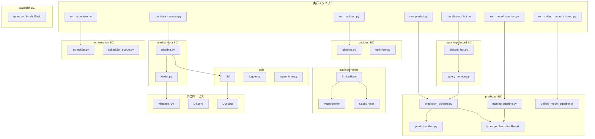

# CuteStock（StockFixer）アーキテクチャナレッジ

本ドキュメントでは、StockFixerプロジェクトのアーキテクチャ、各モジュールの役割、データフローについて詳しく解説します。

---

## 目次
1. [プロジェクト概要](#プロジェクト概要)
2. [ディレクトリ構成](#ディレクトリ構成)
3. [レイヤーアーキテクチャ](#レイヤーアーキテクチャ)
4. [各モジュールの詳細](#各モジュールの詳細)
5. [データフロー](#データフロー)
6. [実行スクリプト一覧](#実行スクリプト一覧)
7. [技術スタック](#技術スタック)
8. [設計思想と原則](#設計思想と原則)

---

## プロジェクト概要

StockFixer（コードネーム: CuteStock）は、**株式自動売買システム**です。

- **Python**: 戦略ロジック、AI価格予測、データ取得・分析、REST API、Discord Bot
- **C#**: 証券会社連携、注文実行、WPF UI（将来実装予定）

主な機能：
- 株価データの自動取得（yfinance経由）
- テクニカル指標の計算（RSI, MACD, EMA, ATR）
- 機械学習モデル（XGBoost, LightGBM）による価格予測
- 売買シグナル生成
- Discord Botによる予測結果の通知

### 時刻処理ポリシー

- 内部処理の日時は UTC を基準とし、timezone-aware な値で扱う。
- 永続化するタイムスタンプ（ジョブ実行時刻、監視更新時刻、生成時刻など）は UTC の ISO 8601 形式を優先する。
- ユーザー向け表示は API 層で日本時間へ変換し、`src/utils/japan_time.py` を経由して整形する。
- Asia/Tokyo が必要なのは「営業日判定」「スケジュール時刻判定」などの業務ロジックであり、保存形式とは分離して扱う。

---

## ディレクトリ構成

```
StockFixer/
├── PROJECT_OVERVIEW.md          # システム概要
├── ARCHITECTURE.md              # 本ドキュメント
└── python/
    ├── run_*.py                 # 実行スクリプト（エントリーポイント）
    ├── requirements.txt         # 依存パッケージ
    ├── Dockerfile               # Docker設定
    ├── データ取得対象.csv        # 対象銘柄リスト
    │
    ├── src/                     # ソースコード（Bounded Context 構成）
    │   │
    │   ├── api/                 # ヘルスチェック・メトリクス層
    │   │   └── metrics.py       # /metrics ヘルスエンドポイント
    │   │
    │   ├── backtest/            # バックテスト BC
    │   │   ├── types.py                 # バックテスト共有型
    │   │   ├── task.py                  # タスク定義
    │   │   ├── pipeline.py              # 単一バックテスト実行
    │   │   ├── optimizer.py             # パラメータ最適化（グリッドサーチ）
    │   │   ├── portfolio.py             # ポートフォリオBT
    │   │   ├── slippage.py              # スリッページモデル
    │   │   ├── stress_test.py           # ストレステスト（歴史的クラッシュ再現）
    │   │   ├── walk_forward.py          # Walk-Forward 検証
    │   │   ├── walk_forward_report.py   # Walk-Forward レポート生成
    │   │   ├── rule_backtester.py       # ルールベースBT エンジン
    │   │   ├── rules/                   # ルール定義パッケージ
    │   │   ├── screener.py              # ボラティリティスクリーナー
    │   │   └── rule_selector.py         # ルール評価・選択
    │   │
    │   ├── market_data/         # 市場データ BC
    │   │   ├── loader.py                # OHLCV データ取得（yfinance）
    │   │   ├── saver.py                 # 生データ DuckDB 保存
    │   │   ├── pipeline.py              # fetch → 特徴量生成 → DuckDB 保存
    │   │   ├── yf_client.py             # yfinance ラッパー（BC 内）
    │   │   └── quality_check.py         # データ品質チェック
    │   │
    │   ├── orchestration/       # スケジューリング BC
    │   │   ├── scheduler.py             # APScheduler ジョブ定義・起動
    │   │   ├── scheduler_queue.py       # ジョブキュー管理
    │   │   └── types.py                 # スケジューラ共有型
    │   │
    │   ├── prediction/          # 予測 BC
    │   │   ├── types.py                 # TrainingMetrics / PredictionResult
    │   │   ├── training_pipeline.py     # 銘柄別モデル学習（XGBoost/LightGBM）
    │   │   ├── unified_model_pipeline.py# 統合モデル学習
    │   │   ├── prediction_pipeline.py   # 全銘柄予測・Top10/Worst10 集計
    │   │   ├── predict_unified.py       # 統合モデルによる予測実行
    │   │   ├── rule_signal_pipeline.py  # ルールベース売買シグナルパイプライン
    │   │   └── models/
    │   │       └── base.py              # モデル抽象基底クラス
    │   │
    │   ├── reporting/           # レポーティング BC
    │   │   ├── types.py                 # レポート共有型
    │   │   ├── monthly.py               # 月次レポート生成
    │   │   ├── query_service.py         # Discord 向けクエリサービス
    │   │   └── discord/
    │   │       ├── discord_bot.py       # Discord Bot（コマンド受付・応答）
    │   │       ├── discord_text.py      # Discord テキスト定数
    │   │       └── rate_limiter.py      # Discord API レートリミッター
    │   │
    │   ├── trading/             # 取引実行 BC
    │   │   └── brokers/
    │   │       ├── base.py              # BrokerBase 抽象基底クラス（OrderSide / OrderType）
    │   │       ├── paper/               # PaperBroker（DuckDB バック仮想売買）
    │   │       └── kabu/                # KabuBroker（kabu STATION® API）
    │   │
    │   ├── watchlist/           # ウォッチリスト BC
    │   │   ├── types.py                 # SymbolTask（バッチ実行単位）
    │   │   └── ticker_list.py           # S&P500 / NASDAQ100 銘柄リスト取得
    │   │
    │   ├── analysis/            # レガシー（→ prediction/ 統合移行中）
    │   │   ├── types.py                 # FeatureLoadResult
    │   │   └── market_regime.py         # マーケットレジーム判定
    │   │
    │   ├── strategy/            # レガシー（→ prediction/ 統合移行中）
    │   │   ├── signal_generator.py      # 売買シグナル生成
    │   │   └── optimal_params_loader.py # 最適パラメータ読込
    │   │
    │   └── utils/               # ユーティリティ層（最下層）
    │       ├── logger.py                # 統一ロガーファクトリー
    │       ├── db/                      # DuckDB 接続・CRUD パッケージ
    │       │   ├── stock_features.py    # stock_features テーブル CRUD
    │       │   ├── market_data.py       # 市場データテーブル CRUD
    │       │   ├── experiment.py        # 実験ログテーブル CRUD
    │       │   ├── index_membership.py  # 指数構成銘柄テーブル CRUD
    │       │   └── quality_log.py       # データ品質ログテーブル CRUD
    │       ├── data_path_utils.py       # パス・ティッカー補正
    │       ├── df_to_string.py          # DataFrame 整形出力
    │       ├── japan_time.py            # 日本時間変換ユーティリティ
    │       ├── yf_client.py             # yfinance ラッパー（共通）
    │       ├── retry_helper.py          # リトライデコレータ
    │       ├── run_context.py           # 実行コンテキスト管理
    │       └── sector_constraints.py    # セクター制約定義
    │
    ├── data/                    # 株価データ保存先
    │   └── stockfixer.duckdb    # DuckDBデータベースファイル
    │
    ├── logs/                    # ログファイル保存先（.gitignore 対象）
    │   ├── stockfixer.log       # 全ログ（INFO以上・RotatingFile 10MB×5世代）
    │   └── stockfixer_error.log # エラーログ（ERROR以上・5MB×3世代）
    │
    ├── models/                  # 学習済みモデル保存先
    │   └── {market}_{symbol}/   # 例: us_AAPL/
    │
    ├── results/                 # 予測結果保存先
    │   └── {YYYYMMDD_HHMMSS}/   # 実行日時別
    │
    └── tests/                   # テスト（Unit/Integration分離）
        ├── unit/                # ユニットテスト（Mock完全・11ファイル）
        ├── integration/         # 統合テスト（実DB/API依存・11ファイル）
        ├── conftest.py          # pytest共有Fixture
        └── README.md            # テスト戦略ドキュメント
```

---

## レイヤーアーキテクチャ

本システムは**クリーンアーキテクチャ**に近い階層構造を採用しています。
**上位層は下位層のみを参照**し、逆方向の依存は禁止されています。

```
┌─────────────────────────────────────────────────┐
│  run_*.py （エントリーポイント）                 │
│  - 引数パースのみ。ビジネスロジックを持たない   │
└─────────────────────────────────────────────────┘
                        ↓
┌─────────────────────────────────────────────────┐
│  reporting/discord/ (discord_bot.py)            │
│  - Discord コマンド受付・Webhook 通知           │
│  api/ (metrics.py)                              │
│  - ヘルスチェック・メトリクスエンドポイント     │
└─────────────────────────────────────────────────┘
                        ↓
┌─────────────────────────────────────────────────┐
│  Bounded Contexts（各 BC は独立した types.py）  │
│                                                 │
│  backtest/      バックテスト・最適化・BT評価    │
│  prediction/    モデル学習・予測・ランキング     │
│  market_data/   データ取得・特徴量・DuckDB保存  │
│  reporting/     月次レポート・Discord クエリ     │
│  watchlist/     銘柄リスト・SymbolTask 管理      │
│  orchestration/ APScheduler ジョブ定義・キュー  │
└─────────────────────────────────────────────────┘
                        ↓
┌─────────────────────────────────────────────────┐
│  trading/brokers/ (BrokerBase DI)               │
│  - 証券会社連携の抽象化（paper / kabu）         │
│  - 上位 BC は BrokerBase のみを参照（DI）       │
└─────────────────────────────────────────────────┘
                        ↓
┌─────────────────────────────────────────────────┐
│  analysis/ + strategy/ （レガシー）             │
│  - market_regime.py, signal_generator.py 等     │
│  - 段階的に各 BC へ統合予定                     │
└─────────────────────────────────────────────────┘
                        ↓
┌─────────────────────────────────────────────────┐
│  utils層 (db/, logger.py, japan_time.py 等)     │
│  - 汎用ユーティリティ・DB アクセス（最下層）   │
└─────────────────────────────────────────────────┘

> **共有型定義** は各 Bounded Context の `types.py` に配置されます（例: `src.watchlist.types.SymbolTask`、`src.prediction.types.PredictionResult`）。BC をまたぐデータ受け渡しにはこれらを直接 import します。
> **config/settings.py** は全 BC に共通な設定値を一元管理し、環境変数でオーバーライド可能です。
```

---

## 各モジュールの詳細

### 共有型（Bounded Context 内 types.py）

DDDフェーズ4完了により、共有型は各 BC の `types.py` に分散配置されました。

| クラス | 配置先モジュール | 説明 |
|--------|----------------|------|
| `SymbolTask` | `src.watchlist.types` | バッチ実行の単位タスク。`market`, `symbol`, `horizon` |
| `FeatureLoadResult` | `src.analysis.types` | 特徴量ロード結果。`is_success` プロパティで判定（→ `src.market_data` 統合予定） |
| `TrainingMetrics` | `src.prediction.types` | モデル学習指標。`rmse`, `directional_accuracy`, `n_samples` |
| `PredictionResult` | `src.prediction.types` | 単一銘柄の予測結果。`to_dataframe(results)` で DataFrame 変換 |

- `PredictionResult.to_dataframe(results)` でリスト → DataFrame 変換
- `PredictionResult.from_dataframe_row(row)` でDBロード時に逆変換
- ML ライブラリ（XGBoost / LightGBM）に渡す特徴量行列 `X` は `pd.DataFrame` のまま維持（型付け対象外）

### config層

#### `config/settings.py`
- **全層共通の設定値を一元管理**する横断的モジュール
- すべての定数が環境変数でオーバーライド可能（デフォルト値はコードで保持）

| 定数 | デフォルト | 環境変数 | 用途 |
|------|-----------|----------|------|
| `MAX_DAILY_LOSS_RATE` | 0.02 | `MAX_DAILY_LOSS_RATE` | 日次損失上限（2%） |
| `MAX_POSITION_RATE` | 0.10 | `MAX_POSITION_RATE` | ポジション上限（10%） |
| `MAX_CONSECUTIVE_LOSSES` | 3 | `MAX_CONSECUTIVE_LOSSES` | 連続損失上限回数 |
| `MAX_POSITIONS` | 10 | `MAX_POSITIONS` | 最大同時保有ポジション数 |
| `HALF_KELLY` | 0.5 | `HALF_KELLY` | ハーフケリー係数 |
| `BUY_THRESHOLD` | 0.005 | `BUY_THRESHOLD` | 買いシグナル閾値（+0.5%） |
| `SELL_THRESHOLD` | -0.005 | `SELL_THRESHOLD` | 売りシグナル閾値（-0.5%） |
| `MAX_ORDERS_PER_RUN` | 5 | `MAX_ORDERS_PER_RUN` | 1回の発注バッチ上限 |
| `PAPER_INITIAL_BALANCE` | 1,000,000 | `PAPER_INITIAL_BALANCE` | ペーパートレード初期残高（円） |

### reporting/discord/ BC（Discord Bot）

#### `discord/discord_bot.py`
- Discord Bot の実装
- `/forecast` コマンドで全マーケットの Top10・ワースト10を送信
- 計算処理は事前実行された DB 上の予測結果を参照

#### `reporting/query_service.py`
- Discord Bot 向けの問い合わせ専用サービス
- 予測結果、ウォッチリスト予測、scheduler 状態を取得する
- API 層へは dataclass を返し、`dict` や生 `DataFrame` 依存を排除

### Bounded Contexts

各 BC は `src/<context>/` 直下に配置され、それぞれ独立した `types.py` を持ちます。
上位の `run_*.py` やスケジューラは BC の公開関数のみを呼び出します。

| BC | パス | 責務 |
|----|------|------|
| `backtest/` | `src/backtest/` | バックテスト・Walk-Forward・ストレステスト・最適化 |
| `prediction/` | `src/prediction/` | 全銘柄予測・統合モデル学習・モデル学習 |
| `market_data/` | `src/market_data/` | データ取得・特徴量生成・DuckDB 保存 |
| `reporting/` | `src/reporting/` | 月次レポート・Discord Bot・クエリサービス |
| `trading/` | `src/trading/` | 証券会社連携（BrokerBase DI） |
| `watchlist/` | `src/watchlist/` | 銘柄リスト・SymbolTask 定義 |
| `orchestration/` | `src/orchestration/` | APScheduler ジョブ定義・ジョブキュー |

#### `market_data/pipeline.py`
- **データ取得 → 特徴量生成 → 保存** の一連の処理を統合
- `save_stock_data_with_features()`: 銘柄データ取得から特徴量付き DB 保存まで

#### `prediction/training_pipeline.py`
- 銘柄別モデル（XGBoost・LightGBM）の学習・保存
- `train_models_for_symbol()`: 1 銘柄に対して両モデルを学習

#### `prediction/prediction_pipeline.py`
- 全銘柄予測と Top10/Worst10 集計・DB 保存
- `predict_all_individual()`: 銘柄別モデルで全銘柄予測
- `predict_all_unified()`: 統合モデルで全銘柄予測
- `output_top_worst_results()`: ランキング出力・DB 保存

#### `backtest/optimizer.py`
- ⭐ **バックテスト最適化特化パイプライン**
- 複数パラメータ（閾値・ストップロス・テイクプロフィット）の組み合わせで Walk-Forward 検証
- `run_optimization()`: パラメータグリッドサーチ実行
- `save_optimal_params_json()`: 最適パラメータを JSON に保存（複数銘柄統合管理）
- **出力**: CSV（詳細結果）+ JSON（最適パラメータ一元管理）

#### `prediction/unified_model_pipeline.py`
- 全銘柄のデータを結合して統合モデルを学習・保存
- `train_unified_models_batch()`: バッチで統合モデルを学習

#### `prediction/models/base.py`
- AI モデルの抽象基底クラス
- `train()`, `predict()`, `save_model()`, `load_model()` の共通インターフェースを定義

#### `prediction/predict_unified.py`
- 統合モデル（全銘柄データを結合して学習したモデル）による予測を実行し `PredictionResult` を返す

### trading/brokers/ BC（証券会社連携）

上位 BC は具体的な証券会社実装に依存せず、`BrokerBase` インターフェースのみを参照することで **依存性逆転** を実現している。

#### `brokers/base.py`
- `BrokerBase`: 証券会社連携の抽象基底クラス（ABC）
- `OrderSide(IntEnum)`: `BUY = 1` / `SELL = 2`
- `OrderType(IntEnum)`: `MARKET = 10` / `LIMIT = 20`
- 必須実装メソッド: `get_token()`, `send_order()`, `cancel_order()`, `get_balance()`, `get_orders()`, `get_positions()`

#### `brokers/paper/paper_broker.py`（PaperBroker）
- `BrokerBase` を継承した**仮想売買ブローカー**
- DuckDB に注文・ポジション・残高を永続化する
- `settle_pending_orders()`: 未決済注文を yfinance 終値で自動約定
  - Phase 1（読み込み）と Phase 2（書き込み）に分割し、yfinance 取得中に接続を保持しない設計
- 初期残高: `PAPER_INITIAL_BALANCE`（`config/settings.py` で管理、デフォルト 1,000,000 円）

#### `brokers/kabu/`（KabuBroker）
- `BrokerBase` を継承した **kabu STATION® API** 実装
- 国内株リアル発注・照会に対応

### analysis/ + strategy/（レガシー層）

> ⚠️ これらは旧レイヤー分割時代のモジュールです。段階的に各 BC へ統合予定。

#### `analysis/market_regime.py`
- マーケットレジーム判定（強気・弱気・中立）
- → `prediction/` BC への統合予定

#### `strategy/signal_generator.py`
- テクニカル分析結果と AI 予測を組み合わせて売買シグナル生成
- シグナル: `Buy` / `Sell` / `Hold`、予測変化率 > 0.5% → Buy、< -0.5% → Sell
- → `trading/` BC への統合予定

### market_data/ BC（データ取得）

#### `market_data/loader.py`
- **`get_stock_data()`**: yfinance から株価データ取得
- **`get_stock_data_from_db()`**: DuckDB から株価データ（特徴量含む）を取得

#### `market_data/saver.py`
- 生データの DuckDB 保存

### utils層

#### `logger.py`
- **統一ロガーファクトリー** — 全レイヤーが `get_logger(__name__)` を呼び出すだけでログを記録できる
- ルートロガーを一度だけ設定（重複防止フラグ `_root_configured` による保護）
- **ハンドラ構成**:
  - `RotatingFileHandler` → `logs/stockfixer.log`（INFO以上・10MB×5世代）
  - `RotatingFileHandler` → `logs/stockfixer_error.log`（ERROR以上・5MB×3世代）
  - `StreamHandler` → stderr
- **ログレベル制御**: 環境変数 `LOG_LEVEL` で上書き可能（デフォルト: INFO）
- **外部ライブラリ抑制**: yfinance / urllib3 / apscheduler のログを WARNING 以上に制限
- **フォーマット**: `[YYYY-MM-DD HH:MM:SS.mmm] [LEVEL] [module] message`

#### `db/`（DuckDB CRUD パッケージ）
- `db/stock_features.py`: `stock_features` テーブルの upsert / load
- `db/market_data.py`: 市場データテーブルの CRUD
- `db/experiment.py`: 実験ログテーブルの CRUD（A/B テスト等）
- `db/index_membership.py`: 指数構成銘柄テーブルの CRUD
- `db/quality_log.py`: データ品質ログテーブルの CRUD
- DuckDB 並列書き込みは禁止。`get_readonly_connection()` を読み取り専用接続に使用する

#### `data_path_utils.py`
- `get_data_subdir()` / `get_models_subdir()`: market/symbol別サブディレクトリ取得
- `get_ticker()`: 市場別ティッカー補正（日本株は `.T` 付与）
- `get_db_path()`: DuckDBファイルパス取得

#### `yf_client.py`
- yfinance の呼び出しラッパー（リトライ・エラーハンドリング統合）

#### `japan_time.py`
- 日本時間変換・表示フォーマット（全表示側はこれを経由する）

#### `retry_helper.py`
- 外部 API 呼び出し向けリトライデコレータ

#### `run_context.py`
- 実行コンテキスト管理（ドライラン判定等）

#### `sector_constraints.py`
- セクター別投資制約定義

#### `df_to_string.py`
- DataFrame の整形出力

---

## データフロー

### 1. データ作成フロー

```
┌──────────────┐    ┌──────────────────────┐    ┌──────────────┐    ┌──────────────┐
│ run_data_    │ → │ market_data/          │ → │ market_data/ │ → │ yfinance API │
│ creation.py  │    │ pipeline.py          │    │ loader.py    │    │              │
└──────────────┘    └──────────────────────┘    └──────────────┘    └──────────────┘
                            ↓
                    ┌──────────────┐    ┌──────────────┐
                    │ 特徴量生成   │ → │ DuckDB 保存  │
                    │（テクニカル）│    │(stockfixer   │
                    └──────────────┘    │ .duckdb)     │
                                        └──────────────┘
```

### 2. モデル学習フロー

```
┌──────────────┐    ┌──────────────────────┐    ┌──────────────┐
│ run_model_   │ → │ prediction/           │ → │ prediction/  │
│ creation.py  │    │ training_pipeline.py │    │ models/      │
└──────────────┘    └──────────────────────┘    │ base.py      │
                            ↓                   └──────────────┘
                    ┌──────────────┐
                    │ joblib 保存  │
                    │ (models/...) │
                    └──────────────┘
```

### 3. 予測・シグナル生成フロー

```
┌──────────────┐    ┌──────────────────────┐    ┌──────────────┐
│ run_predict  │ → │ prediction/           │ → │ prediction/  │
│ .py          │    │ prediction_pipeline  │    │ predict_     │
└──────────────┘    └──────────────────────┘    │ unified.py   │
                            ↓                   └──────────────┘
                    ┌──────────────┐    ┌──────────────┐
                    │ DB 保存      │    │ Discord/API  │
                    │ (DuckDB)     │ → │ 通知出力     │
                    └──────────────┘    └──────────────┘
```

---

## 実行スクリプト一覧

| スクリプト | 用途 | 主な引数 |
|-----------|------|----------|
| `run_data_creation.py` | データ取得・特徴量生成・保存 | `--market us --symbol AAPL` / `--batch` |
| `run_model_creation.py` | 銘柄別モデルの学習・保存 | `--market us --symbol AAPL` / `--batch` |
| `run_unified_model_training.py` | 統合モデルの学習 | `--model-type`, `--no-both` |
| `run_predict.py` | 株価予測（3モード統合） | `--mode single\|watchlist\|top10` |
| `run_backtest.py` | バックテスト実行 | `--market`, `--symbol`, `--start`, `--end` |
| `run_backtest_optimize.py` | バックテストパラメータ最適化（単一銘柄） | `--market`, `--symbol` |
| `run_backtest_optimize_batch.py` | バックテストパラメータ最適化（バッチ） | `--batch` |
| `run_backtest_portfolio.py` | ポートフォリオバックテスト | — |
| `run_backtest_ui.py` | バックテスト結果の UI 表示 | — |
| `run_stress_test.py` | ストレステスト（歴史的クラッシュ再現） | `--market`, `--symbol` |
| `run_walk_forward_report.py` | Walk-Forward 比較レポート生成 | — |
| `run_auto_trade.py` | 自動発注・約定処理 | — |
| `run_monthly_report.py` | 月次レポート生成 | — |
| `run_discord_bot.py` | Discord Botの起動 | — |
| `run_ticker_list.py` | S&P500/NASDAQ100銘柄リスト取得 | — |
| `run_scheduler.py` | スケジューラ起動・即時実行 | `--with-bot`, `--run-now <job>` |

---

## 技術スタック

### Python パッケージ

| パッケージ | 用途 |
|-----------|------|
| `yfinance` | 株価・為替データ取得 |
| `pandas` | データ操作・分析 |
| `duckdb` | 組み込みカラム型DB（株価・予測結果の永続化） |
| `ta` | テクニカル指標計算 |
| `xgboost` | 勾配ブースティングモデル |
| `lightgbm` | 勾配ブースティングモデル |
| `scikit-learn` | 機械学習ユーティリティ |
| `flask` | REST APIサーバー |
| `discord.py` | Discord Bot |
| `joblib` | モデルの永続化 |

### 将来の連携（C#側）
- 楽天証券/SBI証券API連携
- WPF UI（運用状況の可視化）

---

## 設計思想と原則

### 1. レイヤー分離
- 上位層→下位層への一方向参照のみ許可
- 各層は明確な責務を持つ

### 2. runレイヤーはラッパーのみ
`run_*.py` は **CLIラッパーに徹し、ビジネスロジックを持たない**。

**許可される処理:**
- `argparse` による引数パース
- Bounded Context 公開関数の呼び出し（`src.<bc>.<module>.<func>()`）
- 結果の標準出力（`print` / `print_backtest_metrics` 等の表示関数呼び出し）

**禁止される処理:**
- データ変換・条件分岐等のビジネスロジック
- モデル・DB・外部APIへの直接アクセス
- `utils/` 層の直接 `import`（BC を経由すること）

**理由:** run_*.py にロジックが入ると、テスト困難・再利用不可・責務の混在が発生する。
ロジックが必要な場合は対応する BC のパイプライン関数に実装し、`run_*.py` からはそれを呼ぶだけにする。

### 3. モジュラー設計
- 機能ごとにモジュールを分離
- 再利用性と保守性を重視

### 4. 拡張性
- `BaseModel` を継承して新しいAIモデルを追加可能
- `register_model_type()` で動的にモデル登録

### 5. データ管理
- 株価データ・特徴量・予測結果はDuckDBで一元管理
- `stock_features` テーブル: (market, symbol, row_num) を主キーとした株価・特徴量データ
- `prediction_results` テーブル: (run_timestamp, market, symbol) を主キーとした予測結果
- モデルファイルはjoblib形式でファイルシステムに保存
- 設定用CSV（データ取得対象.csv等）はそのまま維持

### 6. 型安全なデータ受け渡し（BC 内 types.py）
- 各 Bounded Context の `types.py` が **Single Source of Truth**（`src.watchlist.types`・`src.analysis.types`・`src.prediction.types` 等）
- `dict` / 生 `pd.DataFrame` 返却を廃止し、意図を明示する dataclass に置き換えた
- ML ライブラリ（XGBoost / LightGBM）が直接必要とする特徴量行列 `X` のみ `pd.DataFrame` のまま維持
- `FeatureLoadResult` の dict 互換メソッドにより、既存コードへの影響を最小化

### 7. セキュリティ
- `.env` で機密情報を管理
- 認証情報のハードコーディング禁止
- ログに認証情報を含めない

### 8. アーキテクチャの方向性（DDD 移行）

DDD フェーズ 3 完了により、`src/services/` は廃止され、各機能は **Bounded Context**（`backtest/`, `prediction/`, `market_data/`, `reporting/`, `trading/`, `watchlist/`, `orchestration/`）に分解されました。残りの移行作業（`analysis/`, `strategy/` の BC 統合）は今後のフェーズで実施予定です。

ターゲット構成・移行スケジュール・判断根拠は以下のドキュメントを参照のこと。

> 📄 **[docs/DDD_ARCHITECTURE.md](DDD_ARCHITECTURE.md)** — DDD 目標アーキテクチャと移行計画


---

## Appendix: Mermaid アーキテクチャ図



---

*Last updated: 2026-02-28*
