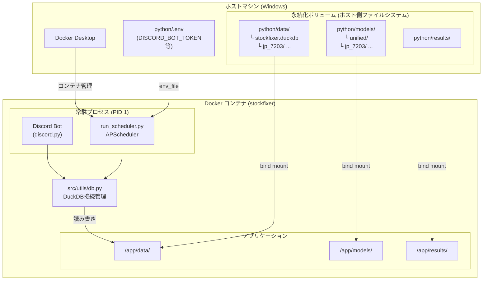
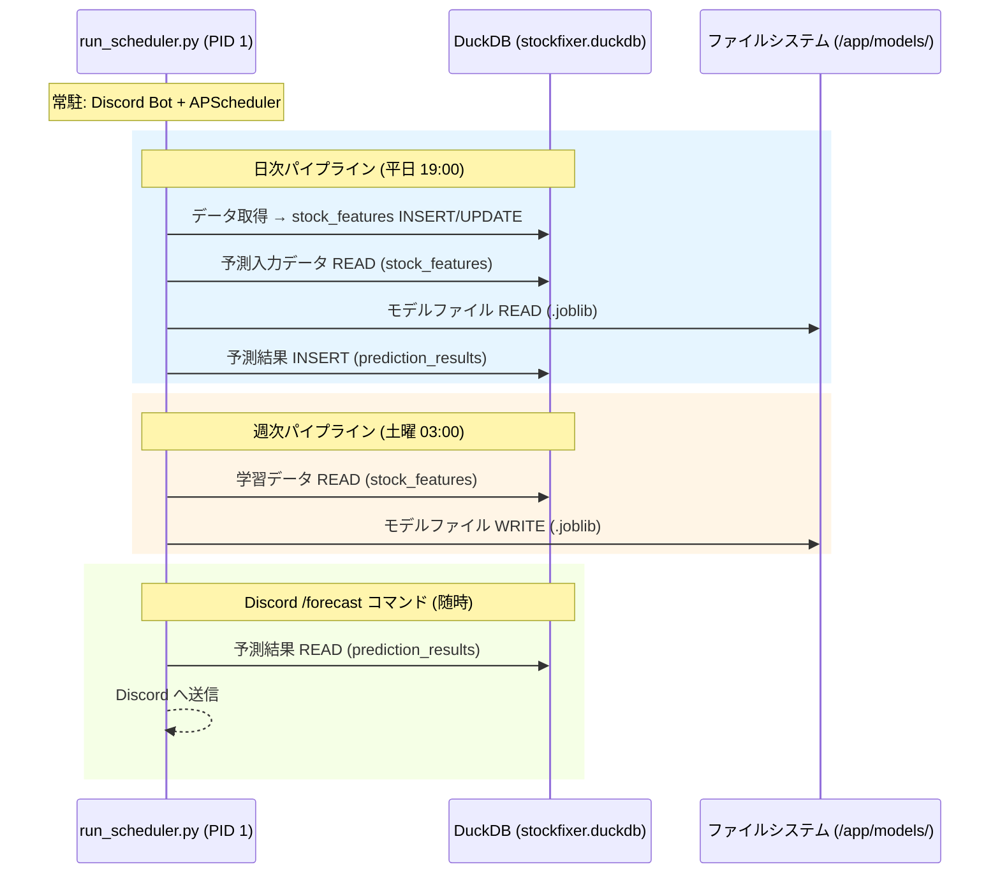
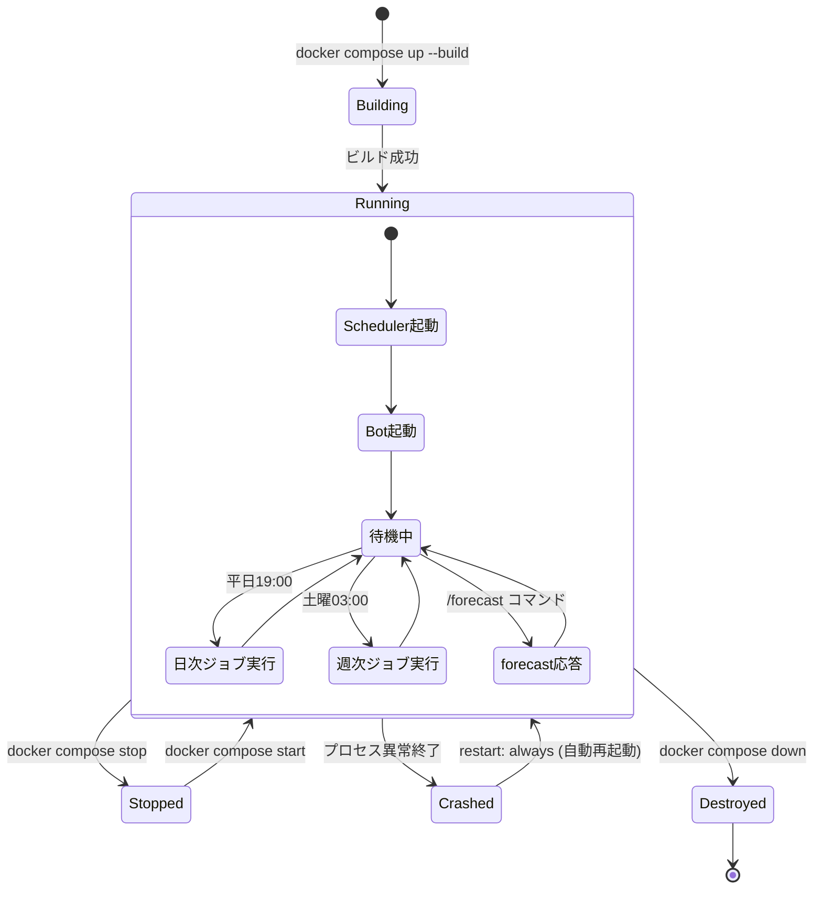

# Docker・DB アーキテクチャ

StockFixer の Docker コンテナ構成と DuckDB の関係を解説する。

---

## 全体構成図



---

## コンテナ内プロセスと DB の関係



---

## ファイル構成と役割

### docker-compose.yml

```yaml
services:
  stockfixer:
    build: ./python
    container_name: stockfixer
    restart: always          # クラッシュ・PC再起動でも自動復帰
    env_file: ./python/.env  # 機密情報はホスト側 .env から注入
    volumes:
      - ./python/data:/app/data       # DuckDB + 生データ
      - ./python/models:/app/models   # 学習済みモデル (joblib)
      - ./python/results:/app/results # 予測結果CSV
```

### volumes のマウント構成

| ホスト側パス | コンテナ内パス | 内容 | 永続化理由 |
|---|---|---|---|
| `python/data/` | `/app/data/` | `stockfixer.duckdb`、銘柄別サブディレクトリ | DB ファイルはコンテナ外に残す必要がある |
| `python/models/` | `/app/models/` | `.joblib` モデルファイル | 学習コスト(数時間)が高いため保持 |
| `python/results/` | `/app/results/` | 予測結果 CSV | 分析・外部参照用 |

### .dockerignore

`data/` `models/` `results/` はイメージに含めず、bind mount で外部から渡す。これによりイメージサイズの削減とデータの永続化を両立する。

---

## DuckDB のロック制約とWALによる改善

DuckDB は **単一プロセスの排他書き込みロック** を使用する。

```
┌─────────────────────────────────────────────────────┐
│  stockfixer.duckdb                                  │
│                                                     │
│  書き込み接続: 1つのプロセスのみ (排他ロック)        │
│  読み取り接続: read_only=True で複数可能             │
└─────────────────────────────────────────────────────┘
```

### WAL（Write-Ahead Logging）の実装

DuckDB は排他ロック時間を最小化するため、接続設定でスレッド並列化とメモリ最適化を行い、読み取り性能を向上させている。

#### 仕組み

```
通常接続:
  メモリ編集 → DBファイル直接更新 → ロック解放
  [その間、他の読み取り = 待機]

DuckDB 最適化接続:
  スレッド並列化 + 効率的なロック管理
  [複数読み取りが効率的に並行処理]
```

#### 実装箇所（src/utils/db.py）

```python
def get_connection() -> duckdb.DuckDBPyConnection:
    db_path = get_db_path()
    
    # DuckDB 接続設定（ロック競合最小化）
    _connection = duckdb.connect(
        db_path,
        threads=4,              # CPU並列処理によるスループット向上
        memory_limit='2GB'      # メモリ制限で安定性確保
    )
    
    _init_tables(_connection)
    return _connection
```

#### 効果

| 項目 | 標準設定 | 最適化後 |
|---|---|---|
| ロック保持時間 | 可変（CPU速度依存） | **短縮**（並列化で効率化） |
| `docker exec` での読み取り | ロック競合リスク | **即座に読める**（複数読み取り効率化） |
| メモリ使用量 | 制限なし | **2GB 上限**（安定性) |
| CPU 並列度 | 1 | **4スレッド** |

---

### 制約事項と運用

**WAL 有効化により、レジスタリ性が大幅に改善されました。**

| 操作 | 可否 | 説明 |
|---|---|---|
| コンテナ内の常駐プロセスが DB を読み書き | **可** | PID 1 がシングルトン接続を保持 |
| `docker exec` で同じ DB に書き込み | **不可** | 常駐プロセスがロックを保持中のため競合 |
| `docker exec` で読み取り | **可** ✓ | WAL有効化により、ロック競合なしで即座に読める |
| `docker compose run` で別コンテナから書き込み | **条件付き** | 常駐コンテナを停止すれば可 |

### バッチ差分更新の実装ポリシー

`src/services/data_pipeline.py` のバッチ更新は、DuckDB書き込み競合を避けるために以下を採用する。

- フェーズ1（並列）: yfinance取得・特徴量生成のみ
- フェーズ2（逐次）: `market_data_raw` の差分保存と `stock_features` 保存

このポリシーにより、差分更新時の同時 `INSERT OR REPLACE` を回避し、待機時間増大やロック競合を抑える。

### テスト実行時の推奨手順

**読み取り専用でのテスト（推奨）:**  
常駐コンテナが起動中でも OK。WAL ログから読み取り：

```powershell
# 常駐コンテナ起動のまま、読み取り専用で確認
docker exec stockfixer python -c "
from src.utils.db import get_readonly_connection
con = get_readonly_connection()
result = con.execute('SELECT COUNT(*) FROM stock_features').fetchall()
print(f'レコード数: {result[0][0]}')
"
```

**書き込みを伴うテスト:**  
常駐コンテナを一時停止してから実行：

```powershell
# 1. 常駐コンテナを停止（ロック解除）
docker compose stop

# 2. 別コンテナでテスト実行
docker compose run --rm stockfixer python run_scheduler.py --run-now daily

# 3. 常駐コンテナを再開
docker compose start
```

---

## コンテナのライフサイクル



---

## 運用コマンド一覧

| 目的 | コマンド |
|---|---|
| ビルド＆起動 | `docker compose up -d --build` |
| ログ確認 | `docker compose logs -f` |
| 停止（データ保持） | `docker compose stop` |
| 再開 | `docker compose start` |
| 完全削除（データはvolumesで残る） | `docker compose down` |
| コンテナ内でコマンド実行 | `docker exec stockfixer python <script>` |
| 別コンテナで一時実行 | `docker compose run --rm stockfixer python <script>` |
| コンテナの状態確認 | `docker ps --filter name=stockfixer` |

---

## 環境変数の流れ

```
python/.env (ホスト側、.gitignore対象)
    │
    │  docker-compose.yml の env_file で指定
    ▼
コンテナ内の環境変数
    │
    │  discord_bot.py: load_dotenv() → os.getenv("DISCORD_BOT_TOKEN")
    ▼
Discord API 認証
```

> **注意**: `.env` は `.dockerignore` で除外されているため、イメージ内には含まれない。`env_file` ディレクティブにより実行時にのみ注入される。

---

*Last updated: 2026-03-01*
